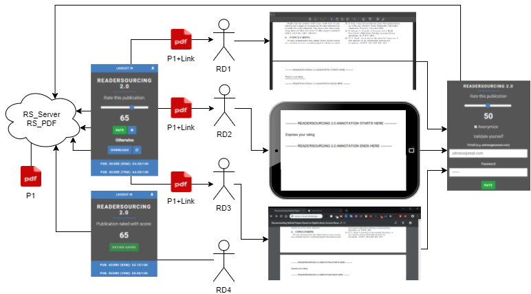

<h1>Info</h1>

This is the official repository for the **Readersourcing 2.0 ecosystem**, recently introduced at the <a href="https://ircdl2019.isti.cnr.it/">IRCDL 2019</a> conference. The original article can be freely accessed on <a href="https://zenodo.org/record/1446468">Zenodo</a>. This repository aggregates <a href="https://git-scm.com/book/it/v2/Git-Tools-Submodules">Git Submodules</a>, indicating that each of the three folders serves as a pointer to a distinct repository. Each repository represents a software component of Readersourcing 2.0. This README consolidates the information from the individual READMEs of these software components. You can review it here in its entirety or independently within the aggregated repositories.

<h2>Bibliographic Record</h2>

```
@inproceedings{10.1007/978-3-030-11226-4_21,
  title        = {{Crowdsourcing Peer Review: As We May Do}},
  author       = {Soprano, Michael and Mizzaro, Stefano},
  year         = 2019,
  month        = 1,
  booktitle    = {{Digital Libraries: Supporting Open Science}},
  location     = {Pisa, Italy},
  publisher    = {{Springer}},
  series       = {{Communications in Computer and Information Science}},
  volume       = {{988}},
  pages        = {{259--273}},
  doi          = {{10.1007/978-3-030-11226-4_21}},
  editor       = {{Manghi, Paolo and Candela, Leonardo and Silvello, Gianmaria}},
  keywords     = {{scholarly publishing, peer review, crowdsourcing}},
  abstract     = {{This paper describes Readersourcing 2.0, an ecosystem providing an implementation of the Readersourcing approach proposed by Mizzaro [10]. Readersourcing is proposed as an alternative to the standard peer review activity that aims to exploit the otherwise lost opinions of readers. Readersourcing 2.0 implements two different models based on the so-called codetermination algorithms. We describe the requirements, present the overall architecture, and show how the end-user can interact with the system. Readersourcing 2.0 will be used in the future to study also other topics, like the idea of shepherding the users to achieve a better quality of the reviews and the differences between a review activity carried out with a single-blind or a double-blind approach.}}
}
```

<h1>Useful Links</h1>

- <a href="https://readersourcing.com">Readersourcing 2.0 (Web Interface)</a>
- <a href="https://zenodo.org/record/1446468">Original Article</a>
- <a href="https://github.com/Miccighel/Readersourcing-2.0-TechnicalDocumentation"> Technical Documentation (GitHub)</a>
- <a href="https://documenter.getpostman.com/view/4632696/RWTiwfV4?version=latest">RESTful API Interface</a>
- <a href="https://doi.org/10.5281/zenodo.1442630">Zenodo Record (RS_Server)</a>
- <a href="https://doi.org/10.5281/zenodo.1442597">Zenodo Record (RS_PDF)</a>
- <a href="https://doi.org/10.5281/zenodo.1442599">Zenodo Record (RS_Rate)</a>
- <a href="https://zenodo.org/record/3245209">Zenodo Record (RS_Py)</a>
- <a href="https://doi.org/10.5281/zenodo.1443370">Zenodo Record (Technical Documentation)</a>

<h1>RS_Server</1>

<h2>Description</h2>

**RS_Server** is the server-side component which has the task of collecting and aggregating the ratings given by readers and using the ```Readersourcing```-based models to compute quality scores for readers and publications.
It is deployed together with an instance of <a href="https://github.com/Miccighel/Readersourcing-2.0-RS_PDF">RS_PDF</a>.
The server-side component exposes a RESTful API Interface and provides a stand-alone web interface to interact directly with the APIs.

Furthermore, there can be different browsers along with their end-users that communicate with the APIs of the server-side component by using
an instance of <a href="https://github.com/Miccighel/Readersourcing-2.0-RS_Rate">RS_Rate</a>, that is, a browser extension.
Thus, every interaction between human readers and the APIs exposed by RS_Server can be carried out through clients installed on readers' browsers or by using the stand-alone web
interface provided. These clients handle the registration and authentication of readers, the rating action and the download action of link-annotated publications.

<h2>Deploy</h2>

There are three main modalities that can be used to deploy a working instance of RS_Server in the **development** or **production** environment.
The former environment must be used if there is the need to:
- add custom ```Readersourcing```-based models;
- extend/modify the current implementation of RS_Server;
- simply to test it in a safe way.

In the following, three deployment modalities to obtain a working instance of RS_Server are described, along with their requirements.
The first two modalities allow both to start RS_Server on the local machine allowing editing of its source code and to
build a Docker image which can be deployed by local containers in a **production**-ready environment.
The third modality allows for deploying RS_Server as a Heroku application.

Please, be sure to read the section dedicated to the **environment variables**, since RS_Server will not work properly without them.

<h3>Modality 1: Manual</h3>

This modality allows to manually download and initialize RS_Server's codebase in a local machine.
This is the most demanding modality in terms of prerequisites since it assumes having a full and working installation of
```Ruby```, ```JDK``` (Java Development Kit) and ```PostgreSQL```. Despite that, it provides more flexibility.

<h4>Requirements</h4>

 - <a href="https://www.ruby-lang.org/en/downloads/">Ruby</a> == 2.7.8;
 - <a href="https://www.oracle.com/it/java/technologies/javase/jdk11-archive-downloads.html">JDK (Java Development Kit)</a> == 11.0.19;
 - <a href="https://www.postgresql.org/download/">PostgreSQL</a> >= 11.2.
 
 <h4>How To</h4>

Clone this repository and navigate to its main directory using a command line prompt (you should see ```app```, ```bin```, ```config```, etc., folders with an ```ls``` or ```dir``` command) 
 then type ```gem install bundler```. This gem (dependency) provides a consistent environment for Ruby projects, as RS_Server, by tracking and installing the exact gems (dependencies) and versions needed.

To fetch all dependencies required by RS_Server, type ```bundle install``` and wait for the process to complete.

The next two commands are necessary only before the first startup of RS_Server because they will create and set up the database. 
Ensure that the ```PostgreSQL``` service is started and ready to accept connections on port ```5432```. Type ```rails db:create``` to create the database 
and ```rails db:migrate``` to create the required tables. Now, create a ```.env``` file as explained later and set the required environment variables. 
Optionally, you can type ```rails db:seed``` to seed some sample data in the database. After these commands, everything is ready to launch RS_Server in _development_ or _production_ mode.
 
To do that, just type ```cd bin``` to move inside ```bin``` directory and then type ```rails server -b 127.0.0.1 -p 3000 -e development```
 with the proper values for ```-b```, ```-p``` and ```-e``` options. If the sample values are used, RS_Server will be started and bound
 on the ```127.0.0.1```IP address with port ```3000``` and ```development``` environment.
 Every HTPP request, therefore, must be sent to the ```http://127.0.0.1:3000``` address.

<h4>Quick Cheatsheet</h4>

- ```cd``` to main directory;
- ```gem install bundler```;
- ```bundle install```;
- ```rails db:create```;
- ```rails db:migrate```;
- ```rails db:seed``` (optional);
- create and populate the ```.env``` file;
- ```cd bin```;
- ```rails server -b <your_ip_address> -p <your_port> -e development``` or ```rails server -b <your_ip_address> -p <your_port> -e production```.

 <h3>Modality 2: Manual (using Docker)</h3>

This modality allows to download and initialize RS_Server's codebase in a local machine using a faster and less frustrating approach
based on Docker, despite being less flexible. Docker is a project which allows automating the deployment phase by distributing an _image_ of an application inside a _container_.

An _image_ is a lightweight, standalone, and executable package of software that includes everything needed to run an application: code, runtime, tools, libraries and settings.
This means that there is no need to manually install the runtimes/libraries/dependencies needed to run an application since the Docker Engine will automatically initialize everything.

A _container_ is a standard unit of software that packages up code and all its dependencies so the application runs quickly and reliably from one computing environment to another.
Only a working installation of **Docker Desktop CE (Community Edition)** is required.

<h4>Requirements</h4>

- <a href="https://www.docker.com/products/docker-desktop">Docker Desktop CE (Community Edition)</a>. 

<h4>How To</h4>

Clone this repository and move inside its main directory using a command line prompt.
Now, type ```ls``` or ```dir```; you should see a ```docker-compose.yml``` file and a ```Dockerfile```.
If you do not see them, please be sure to be in the main directory of the cloned repository.

Before proceeding, _be sure that your Docker Engine is running_, otherwise the following commands will not work.
At this point, two different scenarios can take place.

<h5>Scenario 1: Deploy With Remote Images</h5>

If there is no need to edit the source code of RS_Server, the _Docker Engine_ can fetch the dependencies required in the ```docker-compose.yml``` file and initialize the application.
The dependencies specified in the file are an image of PostgreSQL for the database and one of RS_Server itself, released on the <a href="https://cloud.docker.com/repository/docker/miccighel/rs_server">Docker Hub</a>.

To do this, open the ```docker-compose.yml``` file and uncomment the following section and, additionally, comment out the remaining lines of code.
```
----------- SCENARIO 1: DEPLOY WITH REMOTE IMAGES ----------
...
----------- END OF SCENARIO 1: DEPLOY WITH REMOTE IMAGES ----------
```
Next, from the command line prompt, type ```docker-compose up``` and wait for the process to finish. Note that it may take several minutes. 
Once the Docker Engine completes the process, a container with a working instance of RS_Server will be started.

Optionally, you can type ```docker-compose run rails db:seed``` to seed some sample data in the database. RS_Server will be started and bound 
to the ```0.0.0.0``` IP address with port ```3000``` and the ```production``` environment. Every HTTP request, therefore, must be sent to 
the ```http://0.0.0.0:3000``` address.

As can be seen, there is no need to manually start the server by specifying its IP address, port, and environment, or to create and migrate 
the database. The Docker Engine will perform that automatically. If you want to set a custom IP address or port or switch 
to the _production_ environment, edit the ```command``` key inside the ```docker-compose.yml``` file.

To stop the container, simply type ```docker-compose down```.

<h5>Scenario 2: Deploy With Local Build</h5>

If the source code of RS_Server has been edited, the application must be built from scratch by the Docker Engine according to the structure 
specified in the ```Dockerfile```. After the image build phase, the Docker Engine can fetch the required dependencies outlined in 
the ```docker-compose.yml``` file and initialize RS_Server, as in the previous scenario.

To do this, open the ```docker-compose.yml``` file and uncomment the following section. 
Additionally, comment out the remaining lines of code in the file.
```
-----------  SCENARIO 2: DEPLOY WITH LOCAL BUILD ----------
...
----------- END OF SCENARIO 2: DEPLOY WITH LOCAL BUILD -----------
```
Next, from the command line prompt, type ```docker-compose up``` and wait for the process to finish. Note that it may take several minutes. 
Once the Docker Engine completes the process, a container with a working instance of RS_Server will be started and bound to the ```0.0.0.0``` 
IP address with port ```3000``` and the ```production``` environment. Therefore, every request must be sent to the ```http://0.0.0.0:3000``` 
address.

Similar to the previous scenario, there is no need to manually start the server by specifying its IP address, port, and environment or to 
create and migrate the database. If you want to set a custom IP address or port or switch to the _production_ environment, 
edit the ```command``` key inside the ```docker-compose.yml``` file.

To stop the container, simply type ```docker-compose down```.

<h5>Quick Cheatsheet</h5>

- ```cd``` to main directory;
- create and populate the ```.env``` file;
- ```docker-compose up```;
- ```docker-compose run rails db:seed``` (optionally);
- ```docker-compose down``` (to stop and undeploy).

<h3>Modality 3: Deploy on Heroku</h3>

**Heroku** is a cloud platform-as-a-service (PaaS) that simplifies building, deploying, and scaling web applications and services for 
developers. This deploy modality enables the use of its container registry for a Docker-based production-ready deployment of RS_Server 
on the platform, facilitated by the **Heroku Command Line Interface (CLI)**. It's important to note that this modality can only be used 
with the _production_ environment of the application.

Regarding the prerequisites for this modality, the developer must create an `app` on Heroku and then provision it with two addons:
<a href="https://elements.heroku.com/addons/heroku-postgresql">PostgreSQL</a> for the database and one for mail-related functionalities, 
such as <a href="https://elements.heroku.com/addons/sendgrid">Twilio SendGrid</a>. The Heroku tutorials provide a comprehensive overview 
of the platform. Additionally, a working installation of **Docker Desktop CE (Community Edition)** on the machine used 
for deployment is required.


<h4>Requirements</h4>

- Heroku account;
- Heroku application provisioned with:
 - <a href="https://elements.heroku.com/addons/heroku-postgresql">PostgreSQL</a> addon;
 - a mail-related addon such as <a href="https://elements.heroku.com/addons/sendgrid">Twilio SendGrid</a>;
- <a href="https://devcenter.heroku.com/articles/heroku-cli">Heroku CLI</a>;
- <a href="https://www.docker.com/products/docker-desktop">Docker Desktop CE (Community Edition)</a>.

<h4>How To</h4>

Clone this repository and navigate to the main directory using a command line prompt. Now, type ```ls``` or ```dir```.
You should see a ```Dockerfile```. If not, please ensure you are in the main directory of the cloned repository.

Before proceeding, _make sure that your Docker Engine is running_. Otherwise, the following commands will not work.

Log in using your credentials by typing ```heroku login```. Next, log in to the Heroku container registry by typing ```heroku container:login```.

To build and upload your instance of RS_Server using Docker, type ```heroku container:push web --app your-app-name```. When the process completes, type ```heroku container:release web``` to make it publicly accessible.

Optionally, you can type ```heroku run rails db:seed``` to seed some sample data in the database, and ```heroku open``` to open the browser and be redirected to the homepage of the ```<your_app_name>``` application.

Similar to the previous modality, there is no need to manually start the server by specifying its IP address, port, and environment, 
or to create and migrate the database since Heroku (through the Docker Engine) will take care of that for you.

<h5>Quick Cheatsheet</h5>

- ```cd``` to main directory;
- ```heroku login```;
- ```heroku container:login```;
- ```heroku container:push web --app <your-app-name>```;
- ```heroku container:release web --app <your-app-name>```;
- ```heroku open --app <your-app-name>``` (optional);
- set the environment variables on your Heroku app.

<h4>Environment Variables</h4>

Regardless of the chosen deployment modality, the developer must provide values for (at least a portion of) the _environment variables_, 
as they cannot be checked into a repository due to safety reasons. In the following, each of these available variables is described 
along with an explanation of which deployment modality requires their usage.

| Environment Variable | Description   | Deploy Modality | Environment   | Where To Set  |
|----------------------| ------------- | -------------   | ------------- | ------------- |
| ```SECRET_DEV_KEY```      | Private key used to encrypt strings in the ```development``` environment.         | 1 - 2     | ```development```                   | ```.env``` file             |
| ```SECRET_PROD_KEY```     | Private key used to encrypt strings in the ```production``` environment.          | 1 - 2 - 3 | ```production```                    | ```.env``` file, Heroku app |
| ```POSTGRES_USER```       | Username the admin user of the database.                                          | 1 - 2 - 3 | ```development```, ```production``` | ```.env``` file, Heroku app |
| ```POSTGRES_PASSWORD```   | Password of the admin user of the database.                                       | 1 - 2 - 3 | ```development```, ```production``` | ```.env``` file, Heroku app |
| ```POSTGRES_DB```         | Name of the database.                                                             | 1 - 2 - 3 | ```development```, ```production``` | ```.env``` file, Heroku app |
| ```POSTGRES_HOST```       | Hosting address of the database.                                                  | 1 - 2 - 3 | ```development```, ```production``` | ```.env``` file, Heroku app |
| ```DATABASE_URL```        | Full connection PostgreSQL connection string of the database.                     | 1 - 2 - 3 | ```development```, ```production``` | ```.env``` file, Heroku app |
| ```SMTP_USERNAME```       | Username of the SMTP mail server.                                                 | 1 - 2 - 3 | ```production```                    | ```.env``` file, Heroku app |
| ```SMTP_PASSWORD```       | Password of the SMTP mail server.                                                 | 1 - 2 - 3 | ```production```                    | ```.env``` file, Heroku app |
| ```SMTP_DOMAIN_NAME```    | Domain of the SMTP mail server.                                                   | 1 - 2 - 3 | ```production```                    | ```.env``` file, Heroku app |
| ```SMTP_DOMAIN_ADDRESS``` | Full address of the SMTP mail server.                                             | 1 - 2 - 3 | ```production```                    | ```.env``` file, Heroku app |
| ```EMAIL_BUG_REPORT```    | Email address to receive bug reports.                                             | 1 - 2 - 3 | ```development```, ```production``` | ```.env``` file, Heroku app |
| ```EMAIL_ADMIN```         | Email address to receive general questions.                                       | 1 - 2 - 3 | ```development```, ```production``` | ```.env``` file, Heroku app |
| ```RAILS_LOG_TO_STD```    | When set to ```true```, forces the application to write its logs to the standard output. | 1 - 2 - 3 | ```production```                    | ```.env``` file, Heroku app |

<h4>Setting Variables</h4>

To set an environment variable in a local `.env` file, create it inside the main directory of RS_Server. Then, populate it in a `key=value` fashion.
To set an environment variable in a Heroku app, simply follow [this guide](https://devcenter.heroku.com/articles/config-vars). In Heroku terminology, environment variables are called `config vars`.

To provide an example, the following is the content of a valid `.env` file.

```
SECRET_PROD_KEY=your_secret_prod_key_value
DATABASE_URL=your_postgresql_database_connection_string
SMTP_USERNAME=your_smtp_username
SMTP_PASSWORD=your_smtp_password
SMTP_DOMAIN_NAME=your_smtp_domain_name
SMTP_DOMAIN_ADDRESS=your_smtp_domain_address
EMAIL_BUG_REPORT=your_bug_report_mail
EMAIL_ADMIN=your_contact_mail
```

<h4>Sending Mails</h4>

RS_Server supports any SMTP-based mail server to send emails for tasks such as confirming user registration, reporting bugs,
or recovering forgotten passwords.

Understanding the values used to populate the `SMTP_` environment variables can sometimes lead to ambiguity. Let's consider
the case of the proposed add-on, [Twilio Sendgrid](https://sendgrid.com/), both when deploying RS_Server manually and on Heroku.
In the first case, after creating an account, you need to verify a single
sender address or a whole domain using the provided DNS records. To integrate the service into an instance of RS_Server
deployed anywhere outside Heroku, you must use a supported [SMTP configuration](https://app.sendgrid.com/guide/integrate/langs/smtp).
Thus, the values of the environment variables must be in this form:
- ```SMTP_USERNAME```: ```apikey```
- ```SMTP_PASSWORD```: ```<your_api_key_value>```
- ```SMTP_DOMAIN_NAME```: ```<your_domain_address>```
- ```SMTP_DOMAIN_ADDRESS```: ```smtp.sendgrid.net```

However, while using the <a href="https://elements.heroku.com/addons/sendgrid">addon provided by Heroku</a>, the values provided for the environment variables need to be slightly different:
- ```SMTP_USERNAME```: ```<your_sendgrid_account_username>```
- ```SMTP_PASSWORD```: ```<your_sengrid_password_account>```
- ```SMTP_DOMAIN_NAME```: ```<your_domain_address>```
- ```SMTP_DOMAIN_ADDRESS```: ```smtp.sendgrid.net```

<h4>Connecting To The Database</h4>

A full connection string to a PostgreSQL database provided through the `DATABASE_URL` variable **takes precedence** over 
each `POSTGRES_` variable. It is thus important to provide the former environment variable or the set of the latter ones. 
This holds for both the _development_ and _production_ environments. Indeed, the final connection string is built as such:
```
<%= ENV['DATABASE_URL'] || "postgresql://#{ENV['POSTGRES_USER'] || 'postgres'}:#{ENV['POSTGRES_PASSWORD']}@#{ENV['POSTGRES_HOST'] || 'localhost'}/#{ENV['POSTGRES_DB'] || 'rs_server'}" %>
```
<h4>Logging To The Standard Output</h4>

An instance of RS_Server deployed in development writes its logs to the standard output as the default behavior. 
In a _production_ environment, on the other hand, the logs are written in the `logs/production.log` file. Thus, 
forcing Rails to write logs in the standard output using the `RAILS_LOG_TO_STD` variable can be useful for quick 
debugging purposes when testing the _production_ environment.

<h1>RS_PDF</h1>

<h2>Description</h2>

**RS_PDF** is the software library utilized by [RS_Server](https://github.com/Miccighel/Readersourcing-2.0-RS_Server) to edit the PDF files and add
the required URL when a reader requests to save a publication for later reading. 

It is characterized by a command-line interface, allowing RS_Server to use it directly. Since they are deployed together, they can communicate without the need for complex channels and paradigms.

<h2>Installation</h2>

RS_PDF comes bundled with RS_Server, eliminating the need for manual installation when deploying the latter. However, if you wish to use RS_PDF 
independently, you can simply download the attached `.jar` files from the release section of this repository and place them anywhere on your filesystem.

<h2>Requirements</h2>

- <a href="https://www.oracle.com/it/java/technologies/javase/jdk11-archive-downloads.html">JDK (Java Development Kit)</a> == 11.0.19;

<h2>Command Line Interface (CLI)</h2>

The behavior of RS_PDF is configured during its startup phase by RS_Server through a set of special command-line options. For this reason,
it is useful to provide a list of all the options that can be used if it is necessary to employ RS_PDF in other contexts, modify its implementation,
or for any other reason. However, it is designed to work with a default configuration if no options are provided. The list of command-line options
is shown in the following table:

| Short | Long | Description | Values | Required | Depends On |
|-------|------|-------------|--------|----------|------------|
| `--pIn` | `--pathIn` | Path on the filesystem from which to load the PDF files to be edited. It can be a file or a folder. | String representing a relative path. | No | `--pOut` |
| `--pOut` | `--pathOut` | Path on the filesystem in which to save the edited PDF files. It must be a folder. | String representing a relative path. | No | `--pIn` |
| `--c` | `--caption` | Caption of the link to add. | Any string. | Yes | No |
| `--u` | `--url` | URL to add. | A valid URL. | Yes | No |
| `--a` | `--authToken` | Authentication token received from RS_Server. | A valid authentication token received from RS_Server. | No | `--pOut --pIn --pId` |
| `--pId` | `--publicationId` | Identifier for a publication present on RS_Server. | A valid publication identifier received from RS_Server. | No | `--pOut --pIn --a` |

To provide an execution example, let's assume a scenario where there is a need to edit some files encoded in PDF format with the following prerequisites:

- There is a folder containing `n` files to edit at the path `C:\data`.
- The edited files must be saved inside a folder at the path `C:\out`.
- The file in JAR format containing the library is called `RS_PDF-v1.0-alpha.jar`.
- The JAR file containing RS_PDF is located inside the folder at the path `C:\lib`.

The execution of RS_PDF is initiated with the command: `java -jar C:\lib\RS_PDF-v1.0-alpha.jar -pIn C:\data -pOut C:\out`.

<h1>RS_Rate</h1>

<h2>Description</h2>

**RS_Rate** is an extension designed to function as a client for the Readersourcing 2.0 ecosystem without 
requiring access to its website. Compatible with both [Google Chrome](https://www.google.com/chrome/)
and [Microsoft Edge](https://www.microsoft.com/en-us/edge/) the extension allows users to rate 
publications directly from their browsers. This eliminates the need to navigate to the main website, 
streamlining the process of providing ratings for publications.

The primary objective of **RS_Rate** is to provide readers with a way to seamlessly rate a publication with minimal 
effort—just a few clicks or keystrokes within the Readersourcing 2.0 ecosystem, contributing to a more dynamic 
online reading experience. **RS_Rate** serves as the initial client of our project, extending beyond the web-based 
interface available on the main portal.

Looking ahead, our vision includes expanding the compatibility of **RS_Rate** by developing implementations for 
other major browsers, such as Firefox, Safari, and other popular browsers. Our commitment is to make this rating 
tool accessible across a broad range of browsers, ensuring users can seamlessly interact with content and provide 
feedback, regardless of their preferred browser.

<h2>Installation</h2>

**RS_Rate** is freely available on the Google Chrome Web Store. To use it, simply take advantage of the following 
link and install the currently available version by clicking on the `Get` button shown on the store page. 
We plan to release a Firefox version in the future.

- _Google Chrome_ version: <a href="https://chrome.google.com/webstore/detail/readersourcing-20-rsrate/hlkdlngpijhdkbdlhmgeemffaoacjagg?hl=it">available here</a>

<h2>Usage</h2>

The image shown below illustrates a section of a Google Chrome instance with the extension active for a publication. 
This scenario depicts the typical situation of a reader visiting a publisher's website to access 
the PDF of a paper they are interested in. The image also displays the initial page that a reader 
encounters when interacting with the client. This page serves as a gateway to the login page, as shown 
in the second figure, or to the sign-up page. From the login page, a reader who has forgotten their password 
can access the password recovery page (not shown), which closely resembles the login page itself.


If a reader has yet to sign up for Readersourcing 2.0, they can navigate from the main page to sign-up one and fill in the form. 
Once they complete the standard sign-up and login operations, they will find themselves on the rating page.


In the central section of the rating page, a reader can use the slider to choose a rating value in a 0-100 interval. 
Once they select the desired rating, they only need to click the green `Rate` button, and that's it; with just 
three clicks and a slide action, they can submit their rating. Furthermore, they can also click the options button and, 
if preferred, check an option to anonymize the rating they are about to provide. It's important to note that the reader 
has to be logged in to express an anonymous rating to prevent spamming, which in this case would be a very dangerous 
phenomenon. When such a rating is processed, the information regarding its reader will not be used, except for preventing 
the reader from rating the same publication multiple times.

If the reader prefers to provide their rating at a later time instead of immediately rating the publication, 
they can click the `Save for later` button. This option allows them to take advantage of the editing 
procedure for publications, which stores a reference (an URL link) inside the PDF file they are viewing.
As soon as such the editing procedure is completed (usually just a few seconds), the `Save for later`
button transforms into a `Download` button.


The reader can finally download the link-annotated publication by clicking on it. Furthermore, 
they can also use the refresh button (located to the right of the `Download` button) to, as it says, 
refresh the link-annotated publication. This means that a new copy of the publication file will be downloaded, 
annotated, and made available to the reader. This feature is useful since a publication could be updated at a 
later time by its author.

As soon as the link-annotated publication is downloaded, the reader will find a PDF containing a new final 
page with the URL. Below, an example of such a link-annotated publication can be seen; 
in that case, the reader has chosen to open it with their favorite PDF reader.


Once the reader clicks on the reference, which is a special link to RS_Server, they will be taken to the server-side 
application itself. The interface presented allows them to express their rating independently of the browser extension 
used to store the reference. Therefore, if they send their link-annotated publication to a tablet-like device, for example, 
they can take advantage of the built-in browser to express their rating. Below, the interface that 
the reader sees after clicking on the stored reference is shown. The reader is required to authenticate themselves again as a form 
of security. Without this step, the stored reference could be used by anyone who gets a copy of the link-annotated publication.


Every time a reader rates a publication, every score is updated according to both `RSM` and `TRM` models, and each reader 
can see the result through RS_Rate. In the bottom section of the rating page, the score of the current publication can 
be seen (one for each model), as shown earlier. To view their score as a reader (once again, one for each model), a user 
must click the profile button in the upper right corner. Once they do that, they will see the corresponding interface. 
From there, they can also edit their password since that interface acts as a profile page.


<h1>RS_Py</1>

<h2>Description</h2>

**RS_Py** is an additional component of the Readersourcing 2.0 ecosystem, providing a fully working implementation 
of the RSM and TRM models presented in the original paper. These models are encapsulated by the server-side 
application of Readersourcing 2.0, that is, RS_Server.

Developers with a background in the Python programming language can leverage RS_Py to generate and test new 
simulations of ratings given by readers to a set of publications. They are allowed to alter the internal logic 
of the models to test new approaches without the need to fork and edit the full implementation of Readersourcing 2.0.

<h2>Installation</h2>

To use RS_Py notebooks, it is sufficient to clone the repository and place it somewhere on the filesystem. 
Ensure that the required Python packages are installed by leveraging a distribution such as [Anaconda](https://www.anaconda.com/distribution/). 
If a lightweight installation is preferred, an instance of Python 3.7.3 or higher is needed to install 
the required packages, such as Jupyter, Pandas, and others.

<h2>Usage</h2>

**RS_Py** is organized into five main folders on the filesystem:

- The `data` folder is used to store the dataset exploited to test the models presented in the original paper.
- The `models` folder is used to store the output of these models.
- The `notebooks` folder contains Jupyter notebooks used to generate new datasets and implement the models presented by Soprano et al. (2019).
- The `scripts` folder contains implementations of the Jupyter notebooks as pure Python scripts.
- The `src` folder contains a Python script which converts Jupyter notebooks into pure Python scripts.

Within the `notebooks` folder, three Jupyter notebooks are available:

- `Readersourcing.ipynb` provides an implementation of the RSM model presented by Soprano et al. (2019).
- `TrueReview.ipynb` offers an implementation of the TRM model.
- The `Seeder.ipynb` notebook allows the generation of new datasets, which will be stored inside the `data` folder.

Inside the `src` folder, the `Convert.py` script enables the conversion of notebooks into Python scripts, 
and these are then stored inside the `scripts` folder.

The behavior of `Seeder.ipynb` and `Readersourcing.ipynb` notebooks can be customized by modifying the parameter 
settings found in the initial rows of both notebooks. Table 1, shown below, outlines the parameters available for the former, 
while Table 2 presents the parameters for the latter.

To run and use the Jupyter notebooks, navigate to the main directory of **RS_Py** using a command-line prompt 
(you should see folders such as `data`, `models`, `notebooks`, etc.) and type `jupyter notebook`. 
This command will start the Jupyter server, and you can access the *Notebook Dashboard* in your browser
at the web application's URL (typically, [http://localhost:8888](https://jupyter.readthedocs.io/en/latest/running.html#running)).

| **Parameter**         | **Description**                            | **Values**                  |
|-----------------------|--------------------------------------------|-----------------------------|
| `dataset_name`        | Name of the dataset to simulate             | String                      |
| `papers_number`       | Number of papers to simulate               | Positive integer            |
| `readers_number`      | Number of readers to simulate              | Positive integer            |
| `authors_number`      | Number of authors to simulate              | Positive integer            |
| `months_number`       | Number of months of activity to simulate   | Positive integer            |
| `paper_frequencies`   | Amount of papers rated by each reader group| Array of positive integers  |
| `readers_percent`     | Percentage of readers to assign to a single group | Positive integer    |

**Table 1:** Parameters available for the Seeder Jupyter notebook.

| **Parameter**                  | **Description**                                           | **Values**                  |
|---------------------------------|-----------------------------------------------------------|-----------------------------|
| `dataset_name`                 | Name of the dataset to simulate                            | String                      |
| `day_serialization`            | Activate serialization of data on a per-day basis         | True, False                  |
| `day_serialization_threshold`  | Serialize data every X days                               | Positive integer            |
| `days_number`                  | Amount of days simulated in the input dataset              | Positive integer            |

**Table 2:** Parameters available for the Readersourcing Jupyter notebook.

<h1>Overview</h1>

An overview of Readersourcing 2.0 capabilities is shown below. Let us suppose that there are four readers using RS_Rate to rate a publication, `P1`, namely `RD1`, `RD2`, `RD3`, and `RD4`. Both `RD1`, `RD2`, and `RD3` utilize the *Save for later* functionality of RS_Rate to express their ratings at a later time. By doing this, they receive a link-annotated version of `P1`, namely `P1+Link`.

After some time, `RD1` chooses to open `P1+Link` with his favorite PDF reader. `RD2`, instead, sends it to his tablet, while `RD3` simply opens it with his instance of Google Chrome. When they click on the URL added by RS_Server, they are taken to the special page provided by RS_Server where they provide their ratings. On the contrary, `RD4` simply chooses to give his rating as soon as he finishes reading `P1` directly through the RS_Rate interface.


